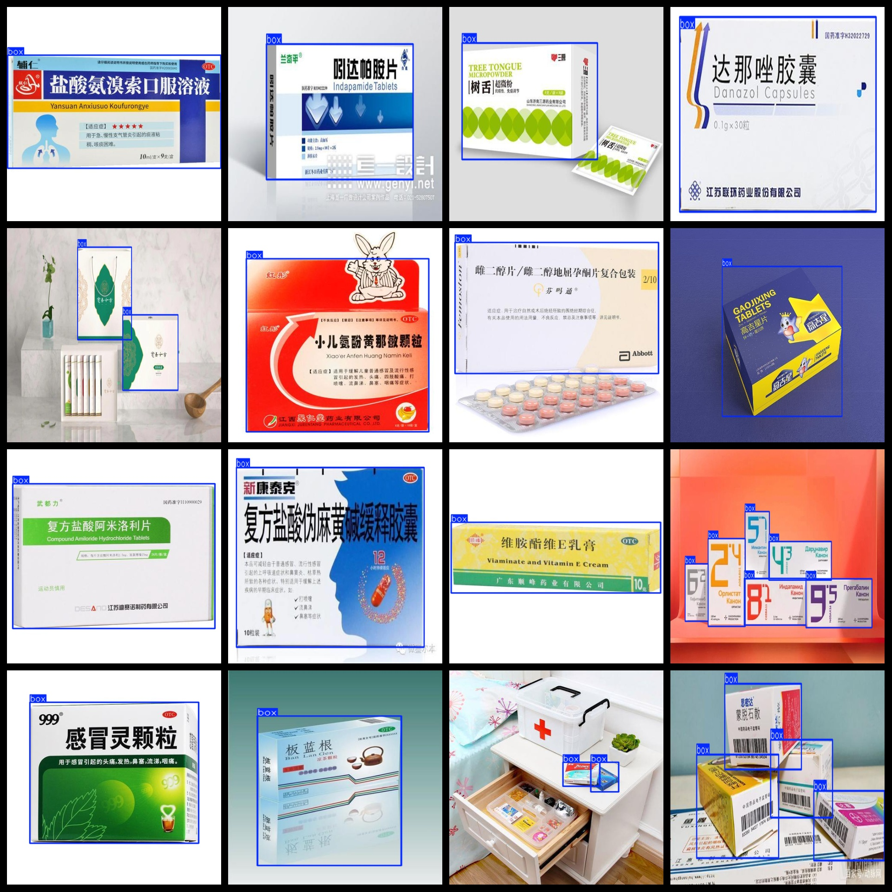

# [Object Detection] Medicine Packaging Box Dataset 1032 imagesVOC+YOLO format

Dataset Description: ~

Dataset format: Pascal VOC format + YOLO format (the txt file does not contain the split path, it only contains jpg images and corresponding VOC format xml files and yolo format txt files)

Number of images (number of jpg files): 1032

Number of annotations (number of xml files): 1032

Number of annotations (number of txt files): 1032

Number of categories: 1

Annotation class names: ["box"]

Number of boxes labeled in each category:

box frame count = 1468

Total boxes: 1468

Use the labeling tool: labelImg

Rules for annotation: Draw a rectangle around the category.

Important Note: None

Special Notice: This dataset does not guarantee the accuracy or precision of the trained models or weight files. The dataset only provides accurate and reasonable annotations.

## Images

---

Here is a pay link on Stripe (https://buy.stripe.com/3cs8yP7sY87d0vu9AB). Please contact me lonlonago@foxmail.com after funding $89, and I will send you a complete data files, thank you!

